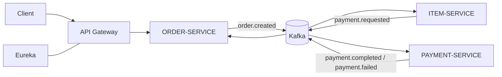
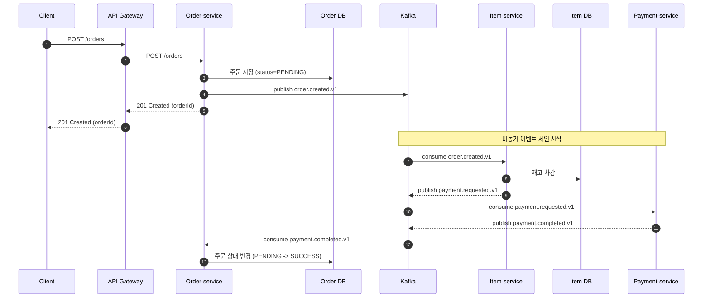

# e-commerce-with-msa-v2

## 개요

이 저장소는 이벤트 기반의 비동기처리로 주문을 처리하는 MSA 프로젝트 데모입니다.  
주문(`order-service`) 생성 이후 재고(`item-service`) 차감과 결제(`payment-service`)를 Kafka 이벤트로 연결하고, 실패 시 보상/복구 흐름까지 포함합니다.

- 아키텍처: Spring Cloud + Eureka + API Gateway + Kafka + JPA

### 시나리오

**기본 시나리오**

1. 주문 생성
2. 재고 차감
3. 결제 요청/완료
4. 주문 상태 확정(`PENDING -> SUCCESS/FAIL/CANCEL`)

**롤백 시나리오**

1. 재고 차감 실패 시 `order.canceled.v1` 발행
2. 결제 실패 시 재고 복구(`payment.failed.v1` 소비)
3. 주문 취소 이벤트 처리 실패 시 DLT(`order.canceled.v1.DLT`) 재처리

## 전체 아키텍처



## 서비스 구성

| 모듈              | 역할                                            |
|-----------------|-----------------------------------------------|
| eureka          | 서비스 레지스트리                                     |
| api-gateway     | 단일 진입점, 라우팅(`/items`, `/orders`, `/payments`) |
| item-service    | 상품 재고 차감/복구, 주문 취소 이벤트 발행                     |
| order-service   | 주문 생성/조회, 주문 상태 전이, 주문 생성 이벤트 발행              |
| payment-service | 결제 요청 이벤트 소비, 결제 성공/실패 이벤트 발행                 |
| common          | 이벤트 DTO 등 공통 코드 모듈 (단독 실행 x)                  |

## Kafka 토픽 맵

| 토픽                    | 발행 서비스              | 소비 서비스                      | 목적                  |
|-----------------------|---------------------|-----------------------------|---------------------|
| order.created.v1      | order-service       | item-service                | 주문 생성               |
| payment.requested.v1  | item-service        | payment-service             | 결제 요청               |
| payment.completed.v1  | payment-service     | order-service               | 주문 성공 확정            |
| payment.failed.v1     | payment-service     | order-service, item-service | 주문 실패 (재고 복구)       |
| order.canceled.v1     | item-service        | order-service               | 재고 차감 실패 (주문 취소)    |
| order.canceled.v1.DLT | Kafka error handler | order-service(DLT consumer) | 주문 취소 이벤트 실패 DLT 적재 |

## 주문 생성 성공 흐름 (요청하신 `POST /order` 기준)

코드상 엔드포인트는 `POST /orders` 입니다.



## 실행하기

### 프로젝트 요구사항

- JDK 21
- Gradle 8.5 이상 ([link](https://docs.gradle.org/current/userguide/compatibility.html))
- Kafka 브로커 3개 (`localhost:9092,9093,9094`)

### 서비스 기동 순서

Linux Shell 명령어:

```bash
./gradlew :eureka:bootRun
./gradlew :api-gateway:bootRun
./gradlew :item-service:bootRun
./gradlew :order-service:bootRun
./gradlew :payment-service:bootRun
```

Windows Shell 명령어:

```powershell
.\gradlew.bat :eureka:bootRun
.\gradlew.bat :api-gateway:bootRun
.\gradlew.bat :item-service:bootRun
.\gradlew.bat :order-service:bootRun
.\gradlew.bat :payment-service:bootRun
```

## API 빠른 사용 예시

API Gateway 로 요청을 보내야 합니다.

### 1) 상품 등록

```bash
curl -X POST http://localhost:8000/items -H "Content-Type: application/json" -d '{"name":"T-Shirt","size":"L","price":30000,"stockQuantity":10}'
```

### 2) 주문 생성

```bash
curl -X POST http://localhost:8000/orders -H "Content-Type: application/json" -d '{"userId":1,"orderLineRequestDtos":[{"itemId":1,"itemQuantity":2,"itemAmount":30000,"itemDiscountedAmount":25000}]}'
```

### 3) 주문 조회

```bash
curl http://localhost:8000/orders/1
```

## 테스트 실행

```bash
./gradlew test
```
